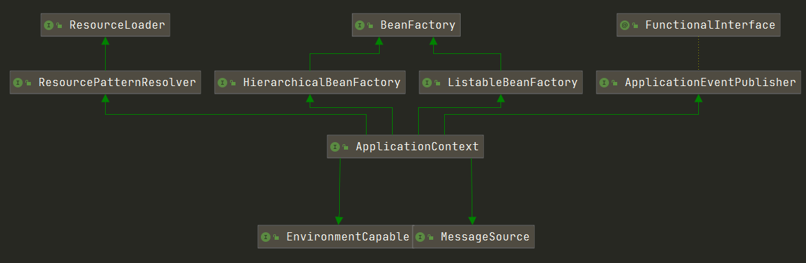
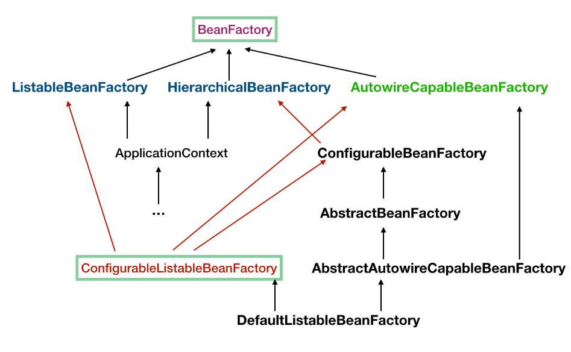
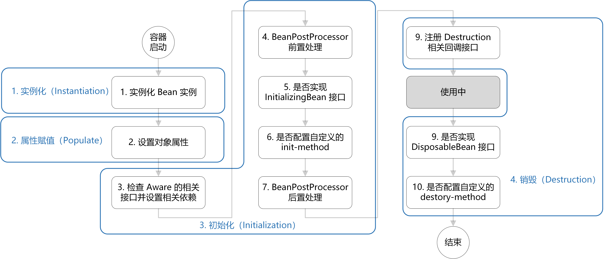

Spring的两个核心实现：IoC（控制反转）、AOP（面向切面编程）

# IoC

Ioc有两个主要的容器系列：**Beanfactory**和**ApplicationContext**

Beanfactory作为最基本的上级接口，该系列只实现了容器的最基本功能；ApplicationContext应用上下文，作为容器的高级形态存在，增加了许多面向框架的特性，同时对应用环境做了许多适配。

在这些容器的接口定义和实现的基础上，Spring通过定义**BeanDefinition**来管理基于Spring应用中的各种对象以及它们之间的**相互依赖关系**。是**Bean的数据抽象**，是容器的主要数据类型。


## 容器接口设计路线



### BeanFactory

从**BeanFacory** 到 **HierarchicalBeanFactory**，再到 **ConfigurableBeanFactory**，是一条主要的设计路径。

- BeanFactory定义了基本的容器规范，包括getBean()这样的基本方法。
- HierarchicalBeanFactory增加了getParentFactory()功能，使其具备了双亲容器的管理功能。
- ConfigurableBeanFactory定义了一些对Beanfactory的配置功能，如setParentFactory()设置双亲Ioc容器、addBeanPostProcessor()配置后置处理器等。

#### 接口方法

- **getBean()**：根据指定的Bean**名字**、**类型**来获取想要的Bean。如果需要获取的Bean是**Prototype** 的，那么还可以提供其**构造方法的对应参数**，来控制生成的Bean。
- **containsBean()**：判断容器是否含有指定名字的Bean。
- **isSingleton()**：查询指定名字的Bean是否是Singleton类型的。
- **isPrototype()**：查询指定名字的Bean是否是Prototype类型的。
- **isTypeMatch()**：查询指定名字的Bean的Class类型是否是特定的类型。
- **getType()**：查询指定名字的Bean的Class类型。
- **getAliases()**：查询指定名字的Bean的所有别名（在BeanDefinition中定义）。

#### XmlBeanFactory

XmlBeanFactory继承了DefaultListableBeanFactory，增加了新的功能；它是一个可以读取**以XML文件方式定义的BeanDefinition**的IoC容器。

XmlBeanFactory中，初始化了一个**XmlBeanDefinitionReader**对象，从而可以处理XML。在**构造**XmlBeanFactory时，需要指定**BeanDefinition**的信息来源，而这个来源需要封装成Spring中的**Resource**类（Spring用来封装I/O操作的类）来给出。

```java
DefaultListableBeanFactory factory = new DefaultListableBeanFactory();
XmlBeanDefinitionReader reader = new XmlBeanDefinitionReader(factory);
ClassPathResource res = new ClassPathResource("beans.xml");
reader.loadBeanDefinition(res);
```


### ApplicationContext

从**BeanFactory**到**ListableBeanFactory**，再到**ApplicationContext**，再到常用的**WebApplicationContext**或者**ConfigurableApplicationContext**接口。

- ListableBeanFactory中细化了许多BeanFactory的接口功能，比如定义了getBeanDefinitionNames()方法
- 前面提到过的HierarchicalBeanFactory接口
- ApplicationContext接口，继承了**MessageSource**、**ResourceLoader**、**ApplicationEventPublisher**接口，添加了许多对高级容器特性的支持。

#### 特性

- 扩展了MessageSource接口，支持不同的信息源，可开发**多语言**的应用
- 访问资源。支持ResourceLoader和Resource，可以从不同的I/O途径获取Bean的定义信息。
- 支持**应用事件**。继承了ApplicationEventPublisher，在上下文中引入了事件机制，这些事件和Bean的生命周期结合，为Bean的管理提供便利。
- 在ApplicationContext中提供的其他各种附加服务。


## IoC容器的初始化过程

IoC容器的初始化是由**refresh()**方法来启动的。具体来说，这个启动包括了BeanDefinition的Resource**定位**、**载入**和**注册**三个基本过程。这三个过程是分开的，使得用户可以更加灵活的对这三个过程进行裁剪或扩展。

### Resource定位

较为底层的容器如DefaultListableBeanFactory需要使用BeanDefinitionReader才能处理Resource信息，如上文所写。而在ApplicaitonContext中，Spring提供了不同的读取器的实现。**AbstractApplicationContext的基类是DefaultResourceLoader**，因而它的每个实现类都有读入Resource定义的BeanDefinition的能力。

例如FileSystemXmlApplicationContext可以从**文件系统**中载入，ClassPathXmlApplicationContext可以从**ClassPath**中载入，XmlWebApplicationContext可以从**Web容器**中载入，等等。

对BeanDefinition资源定位的过程，最初是由**refresh**来触发的，而这个refresh的调用是在FileSystemXmlBeanFactory的**构造函数**中启动的。refresh中包含了许多操作，这里先看一下关于Resource定位和加载的方法。


其中最重要的就是**loadBeanDefinitions**及其相关的重写、重载的方法了。

#### **DefaultListableBeanFactory**

ConfigurableListableBeanFactory实现了 BeanFactory 下面一层的所有三个接口，它只有一个实现类 DefaultListableBeanFactory，而这个实现类通过实现右边的 AbstractAutowireCapableBeanFactory 来获得了许多特性，因而几乎是功能最多的BeanFactory了。



### BeanDefinitions载入

在各种BeanDefinitionReader（实现类）中，有许多加载BeanDefinition的重要方法。在XmlBeanDefinitionReader的**doLoadBeanDefinitions**中将XML文件转换为**Document对象**，之后调用BeanDefinitionDocumentReader的**registerBeanDefinitions**方法对BeanDefinition进行处理，处理的结果由BeanDefinitionHolder来持有。

而具体的解析，是在DocumentReader创造的BeanDefinitionParserDelegate中完成的；生成的**BeanDefinitionHolder**中除了包含一个BeanDefinition以外，还有id、name、aliase等属性元素。

在调用Delegate解析之前，会定义一个**parent**用于递归问题。因为在`<beans>`标签内部依然是可以定义`<beans>`的，所以这个方法的参数`Element root`不一定就是Xml的根节点，也可能是**嵌套**在内部的bean。在往下，还会检查这个bean的**profile**，如果不符合当前的profile，则直接return。

最后是核心解析方法**parseBeanDefinitions**。对于每一个节点，都会对默认的namespace和其他的namespace进行解析。

```java
				if (node instanceof Element) {
					Element ele = (Element) node;
					if (delegate.isDefaultNamespace(ele)) {
						parseDefaultElement(ele, delegate);
					}
					else {
						delegate.parseCustomElement(ele);
					}
				}
```

parseDefaultElement(ele, delegate) 解析的节点是 `<import />`、`<alias />`、`<bean />`、`<beans />` 这几个。而对于其他的标签，将进入到 delegate.parseCustomElement(element) 这个分支。如我们经常会使用到的 `<mvc />`、`<task />`、`<context />`、`<aop />`等。

这些属于扩展，如果需要使用上面这些 ”非 default“ 标签，那么上面的 **xml 头部**的地方也要引入相应的 namespace 和 .xsd 文件的路径。

而对于Default节点，我们重点关注`<bean />`标签，也就是**processBeanDefinition**方法。首先，将 `<bean /> `节点中的信息提取出来，然后封装到一个 **BeanDefinitionHolder** 中；`<bean />`标签中可定义的属性如下所示：

| Property                 |                                                              |
| ------------------------ | ------------------------------------------------------------ |
| class                    | 类的全限定名                                                 |
| name                     | 可指定 id、name(用逗号、分号、空格分隔)                      |
| scope                    | 作用域                                                       |
| constructor arguments    | 指定构造参数                                                 |
| properties               | 设置属性的值                                                 |
| autowiring mode          | no(默认值)、byName、byType、 constructor                     |
| lazy-initialization mode | 是否懒加载(如果被非懒加载的bean依赖了那么其实也就不能懒加载了) |
| initialization method    | bean 属性设置完成后，会调用这个方法                          |
| destruction method       | bean 销毁后的回调方法                                        |

提取 `<bean /> `信息封装到BeanDefinitionHolder是由Delegate的**parseBeanDefinitionElement**方法实现的。首先处理name、id、aliase，如果没有指定id，则使用别名列表的第一个名字作为beanName。之后调用的**`parseBeanDefinitionElement(ele, beanName, containingBean)`**方法根据 `<bean ...>...</bean> `中的配置创建 **BeanDefinition**，然后把配置中的信息都设置到实例中，一个 BeanDefinition 实例就被创建完成了。

### Bean注册

在进行载入之后，BeanDefinition信息已经在IoC容器内建立起了自己的数据结构以及相应的数据表示，但是此时数据还**不能供IoC容器直接使用**，需要在容器中对这些BeanDefinition进行**注册**。在DefaultListableBeanFactory中，是通过一个**HashMap**来持有载入的BeanDefinition的。

```java
	/** Map of bean definition objects, keyed by bean name. */
	private final Map<String, BeanDefinition> beanDefinitionMap = new ConcurrentHashMap<>(256);
```

上一步BeanDefinition在完成解析后，被包装成一个**BeanDefinitionHolder**，返回到processBeanDefinition方法中，并进行下一步的注册，调用**BeanDefinitionReaderUtils**的**registerBeanDefinition**方法。这里用到了**BeanDefinitionRegistry**这个接口的registerBeanDefinition方法；**DefaultListableBeanFactory**实现了这个接口，并实现了这个方法。

在方法中，首先会根据beanName去map中查找，如果发现在map中已有同名的bean存在，则根据不同的覆盖策略，对bean进行**覆盖**。如果没有重复，则进行正常的注册。

首先判断判断是否已经有其他的 Bean 开始初始化了，如果没有冲突，则直接将BeanDefinition存入map中，同时按照注册的顺序保存每一个bean的名字。如果有冲突的话，使用**synchronized**对map进行加锁，在将其存入map，并更新beanName列表。


## IoC容器的依赖注入

**依赖注入的过程，是用户第一次向IoC容器索要Bean的时候触发的。**不过也有例外，可以在BeanDefinition信息中通过控制**lazy-init**属性，来让容器完成对Bean的**预实例化**，也就是完成依赖注入。

先回顾一下之前说到IoC容器启动时调用的**refresh**方法，这个方法在完成上述的Bean的注册之后，又进行了一系列的设置BeanFactory、注册几个特殊的Bean、注册和调用BeanFactoryPostProcessor、注册BeanPostProcessor、国际化、初始化事件广播器、注册事件监听器等操作；最重要的，调用**`finishBeanFactoryInitialization(beanFactory)`**进行单例Bean的初始化（lazy-init的除外）。在进行一些准备之后，调用**preInstantiateSingletons**方法来正式的进行初始化，这个方法由**DefaultListableBeanFactory**进行实现。

只加载**非抽象**、**非懒加载**、**Singleton**的Bean。而对于**FactoryBean**，会在beanName前加上一个**FACTORY_BEAN_PREFIX前缀即 ' & ' 符号**；对于普通的Bean，只要调用**`getBean(beanName)`**就行了。

这之后所有非懒加载的Singleton beans就已经完成了初始化，如果bean实现了SmartInitializingSingleton接口的话，将在这里进行回调处理。

### FactoryBean

FactoryBean适用于**Bean的创建过程比较复杂**的场景，比如数据库连接池的创建。

```java
public interface FactoryBean<T> {
    T getObject() throws Exception;
    Class<T> getObjectType();
    boolean isSingleton();
}
```

```JAVA
public class Person { 
    private Car car ;
    private void setCar(Car car){ this.car = car;  }  
}

public class MyCarFactoryBean implements FactoryBean<Car>{
    private String make; 
    private int year ;
    public void setMake(String m){ this.make =m ; }
    public void setYear(int y){ this.year = y; }

    public Car getObject(){ 
      // 这里我们假设 Car 的实例化过程非常复杂
      CarBuilder cb = CarBuilder.car();
      if(year!=0) cb.setYear(this.year);
      if(StringUtils.hasText(this.make)) cb.setMake( this.make ); 
      return cb.factory(); 
    }

    public Class<Car> getObjectType() { return Car.class ; } 
    public boolean isSingleton() { return false; }
}
```

```XML
<bean class = "com.java.MyCarFactoryBean" id = "car">
  <property name = "make" value ="Honda"/>
  <property name = "year" value ="1984"/>
</bean>
<bean class = "com.java.Person" id = "josh">
  <!-- 设定使得Person的Bean依赖于这个FactoryBean -->
  <property name = "car" ref = "car"/>
</bean>
```

或者使用Java config来配置：

```java
@Configuration 
public class CarConfiguration { 
    @Bean 
    public MyCarFactoryBean carFactoryBean(){ 
      MyCarFactoryBean cfb = new MyCarFactoryBean();
      cfb.setMake("Honda");
      cfb.setYear(1984);
      return cfb;
    }

    @Bean
    public Person aPerson(){ 
        Person person = new Person();
        // 使用getObject()来返回Bean本身的类型
        person.setCar(carFactoryBean().getObject());
        return person; 
    } 
}
```


### getBean(beanName)、createBean

**AbstractBeanFactory**的**getBean**方法用于从BeanFactory中获取一个Bean，而每个Bean**初始化**的过程也被封装到了这个方法里。这个方法的真正功能在它调用的**doGetBean**方法中。

- 先进行一些**检查**，例如是否已经创建过，检查BeanFactory中是否存在BeanDefinition并沿着双亲BeanFactory链向上查找，是否已经创建过了Prototype类型的bean。检查结束则意味着要**创建一个新的Bean**。
- 先初始化所有的**依赖**Bean，触发getBean的递归调用，直至所有的依赖Bean都被创建成功。如果有循环依赖（不同于能处理的那种），则抛出异常。
- 按设定调用**`createBean`**创建Singleton或者Prototype类型的Bean，而后**检查类型**是否正确，最后进行返回

**AbstractAutowireCapableBeanFactory**实现了createBean方法。

```java
protected abstract Object createBean(String beanName, RootBeanDefinition mbd, Object[] args) throws BeanCreationException;
```

先是进行一些检查，确保BeanDefinition中的Class已被加载，准备方法覆写MethodOverrides，让 InstantiationAwareBeanPostProcessor 返回代理等；之后便是调用**doCreateBean**真正进行Bean的创建。

- 对是否发生**循环依赖**进行检查和处理
- 进行**属性装配**，即赋值
- 处理 bean 初始化完成后的各种回调，如init-method, InitializingBean, BeanPostProcessor等

整个doCreateBean方法中有几个细节部分，其中较为重要的有**创建 Bean 实例**的 createBeanInstance 方法，**依赖注入**的 populateBean 方法，还有**回调方法** initializeBean。

#### createBeanInstance

首先进行一系列的检查，之后对Bean进行实例化。SimpleInstantiationStrategy类提供了两种实例化Java对象的方法：一种是通过BeanUtils，它使用了JVM的**反射**功能；另一种通过**CGLIB**来进行实例化。

如果存在方法覆写，利用 CGLIB 来完成实例化，需要依赖于 CGLIB 生成子类；如果不使用 CGLIB 的话，存在 **Override** 的情况时 JDK 并没有提供相应的实例化支持。

#### populateBean

Bean实例的所有属性都被封装到了一个类中。

```java
 PropertyValues pvs = mbd.getPropertyValues();
```

可以根据不同的配置选择根据**名字**还是根据**类型**来对属性值进行装配，将需要的属性全部更新到 PropertyValues pvs 中。最后调用applyPropertyValues方法，设置实例的属性值。

#### initializeBean

按顺序处理各种回调，顺序如下：

- **BeanNameAware**、**BeanClassLoaderAware** 或 **BeanFactoryAware** 接口
- BeanPostProcessor 的 **postProcessBeforeInitialization** 方法
- bean 中 bean 实现了 **InitializingBean** 接口，调用 **afterPropertiesSet** 方法（先）或者执行定义的 **init-method** 方法（后）
- BeanPostProcessor 的 **postProcessAfterInitialization** 方法

```java
	protected Object initializeBean(final String beanName, final Object bean, @Nullable RootBeanDefinition mbd) {
		if (System.getSecurityManager() != null) {
			AccessController.doPrivileged((PrivilegedAction<Object>) () -> {
				invokeAwareMethods(beanName, bean);
				return null;
			}, getAccessControlContext());
		}
		else {
            // 如果 bean 实现了 BeanNameAware、BeanClassLoaderAware 或 BeanFactoryAware 接口，回调
			invokeAwareMethods(beanName, bean);
		}

		Object wrappedBean = bean;
		if (mbd == null || !mbd.isSynthetic()) {
            // BeanPostProcessor 的 postProcessBeforeInitialization 回调
			wrappedBean = applyBeanPostProcessorsBeforeInitialization(wrappedBean, beanName);
		}

		try {
      		// 如果 bean 实现了 InitializingBean 接口，调用 afterPropertiesSet() 方法（1）
            // 或者处理 bean 中定义的 init-method（2）
			invokeInitMethods(beanName, wrappedBean, mbd);
		}
		catch (Throwable ex) {
			throw new BeanCreationException(
					(mbd != null ? mbd.getResourceDescription() : null),
					beanName, "Invocation of init method failed", ex);
		}
		if (mbd == null || !mbd.isSynthetic()) {
            // BeanPostProcessor 的 postProcessAfterInitialization 回调
			wrappedBean = applyBeanPostProcessorsAfterInitialization(wrappedBean, beanName);
		}
		return wrappedBean;
	}
```

至此，Bean的初始化流程基本结束。


## 相关问题

### BeanPostProcessor

```java
public interface BeanPostProcessor {
   Object postProcessBeforeInitialization(Object bean, String beanName) throws BeansException;
   Object postProcessAfterInitialization(Object bean, String beanName) throws BeansException;
}
```

除了我们自己定义的 BeanPostProcessor 实现外，Spring 容器在启动时自动给我们也加了几个，如ApplicationContextAwareProcessor、ApplicationListenerDetector。

这个方法接受的第一个参数是 bean 实例，第二个参数是 bean 的名字，重点在**返回值将会作为新的 bean 实例**；所以应该要返回经过处理的bean实例，而不是null或者其他的错误对象。既然有了 bean 的实例以及 beanName，就可以对 bean 实例进行一些处理，例如返回一个代理对象。

至于这个方法的执行时机，是在 **bean 实例化完成、属性注入完成之后**，会执行回调方法；具体可以参照 AbstractAutowireCapableBeanFactory#initBean 方法。


### Bean的生命周期

Bean 的生命周期概括起来就是 **4 个阶段**，主要方法都在**AbstractAutowireCapableBeanFactory**的doCreateBean中：

1. 实例化（Instantiation）：**createBeanInstance**方法实例化一个Bean对象
2. 属性赋值（Populate）：**populateBean**方法为Bean设置相关属性和依赖
3. 初始化（Initialization）：**initializeBean**方法进行一系列的初始化操作：BeanPostProcessor、InitializingBean、init-method
4. 销毁（Destruction）：**registerDisposableBeanIfNecessary**方法注册销毁策略：DisposableBean的destroy()方法

InitializingBean接口、Disposable接口底层使用**类型强转.方法名()**进行直接方法调用，init-method、destory-method底层使用**反射**；前者和Spring耦合程度更高但效率高，后者解除了和Spring之间的耦合但是效率低，使用哪个看个人喜好。

**某个Bean的afterPropertiesSet()方法执行完毕才会执行下一个Bean的afterPropertiesSet()方法**，因此不建议在afterPropertiesSet()方法中写处理时间太长的方法



