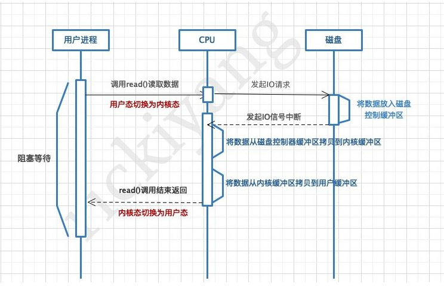

## 文件读写基本流程

**读文件**

1. 进程调用库函数向内核发起读文件请求；
2. 内核通过检查**进程**的**文件描述符**定位到虚拟文件系统的已打开文件列表项；
3. 调用该文件可用的系统调用函数 `read()`；（需要切换到内核态）
4. `read()` 函数通过文件表项链接到**目录项**模块，根据传入的文件路径，在目录项模块中检索，找到该文件的 `inode`；
5. 在 `inode` 中，通过文件**内容偏移量**计算出要读取的**页**；
6. 通过 `inode` 找到文件对应的 `address_space`；
7. 在 `address_space` 中访问该文件的页缓存树，查找对应的**页缓存结点**：
   1. 如果页缓存命中，那么直接返回文件内容；
   2. 如果页缓存缺失，那么产生一个页缺失异常，创建一个页缓存页，同时通过`inode` 找到文件该页的**磁盘地址**，读取相应的页填充该缓存页；
   3. 重新进行第 6 步查找页缓存；
8. 文件内容读取成功。

总结一下：`inode` 管磁盘，`address_space` 接内存，两者互相指针链接。

`Inode` 是文件系统(VFS)下的概念，通过 **一个 inode 对应一个文件** 使得文件管理按照类似索引的这种树形结构进行管理，通过 `inode` 快速的找到文件在磁盘扇区的位置；但是这种管理机制并不能满足读写的要求，因为我们修改文件的时候是先修改内存里的，所以就有了页缓存机制，作为内存与文件的缓冲区。
`address_space` 模块表示一个文件在页缓存中已经缓存了的物理页。它是页缓存和外部设备中文件系统的桥梁。如果将文件系统可以理解成数据源，那么 `address_space` 可以说关联了内存系统和文件系统。

**写文件**

前5步和读文件一致，在 `address_space` 中查询对应页的页缓存是否存在；

1. 如果页缓存命中，直接把文件内容修改更新在页缓存的页中，写文件就结束了。这时候**文件修改位于页缓存，并没有写回到磁盘文件中去。**
2. 如果页缓存缺失，那么产生一个页缺失异常，创建一个页缓存页，同时通过 `inode` 找到文件该页的磁盘地址，**读取相应的页填充该缓存页**。此时缓存页命中，进行第 6 步。
3. 一个页缓存中的页如果被修改，那么会被标记成脏页，脏页需要写回到磁盘中的文件块。有两种方式可以把脏页写回磁盘：
   1. 手动调用 `sync()` 或者 `fsync()` 系统调用把脏页写回；
   2. pdflush 进程会定时把脏页写回到磁盘。

同时注意，脏页不能被置换出内存，如果脏页正在被写回，那么会被设置写回标记，这时候该页就被上锁，其他写请求被阻塞直到锁释放。

## Linux I/O 读写方式

Linux 提供了轮询、I/O 中断以及 DMA 传输这 3 种磁盘与主存之间的数据传输机制。其中轮询方式是基于死循环对 I/O 端口进行不断检测。I/O 中断方式是指当数据到达时，磁盘主动向 CPU 发起中断请求，由 CPU 自身负责数据的传输过程。 DMA 传输则在 I/O 中断的基础上引入了 DMA 磁盘控制器，由 DMA 磁盘控制器负责数据的传输，降低了 I/O 中断操作对 CPU 资源的大量消耗。

### I/O 中断

在 DMA 技术出现之前，应用程序与磁盘之间的 I/O 操作都是通过 CPU 的中断完成的。每次用户进程读取磁盘数据时，都需要 CPU 中断，然后发起 I/O 请求等待数据读取和拷贝完成，每次的 I/O 中断都导致 CPU 的上下文切换。

使用 I/O 中断方式读取数据步骤：

1. 用户进程向 CPU 发起 read 系统调用读取数据，由**用户态切换为内核态**，然后一直**阻塞**等待数据的返回；
2. CPU 在接收到指令以后对磁盘发起 I/O 请求，将磁盘数据先放入**磁盘控制器缓冲区**；
3. 数据准备完成以后，磁盘向 CPU 发起 **I/O 中断**；
4. CPU 收到 I/O 中断以后将磁盘缓冲区中的数据拷贝到**内核缓冲区**，然后再从内核缓冲区拷贝到**用户缓冲区**；
5. 用户进程由内核态切换回用户态，解除阻塞状态，然后等待 CPU 的下一个执行时间钟。

